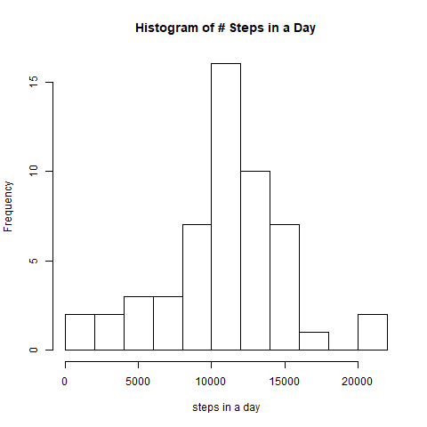
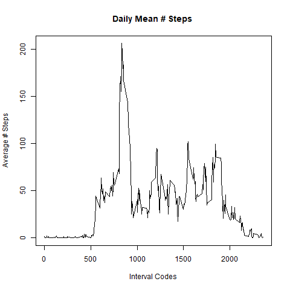

```r
knitr::opts_chunk$set(echo = TRUE, comment=NA)
```
##### **IMPORTANT! IF YOU CANNOT SEE FIGURES WHEN YOU OPEN MD FILE, CLICK ON A THIN STRIP (WHICH SEEMS TO BE A COMPRESSED FIGURE) BELOW EACH CODE `knitr::include_graphics(...)` THAT IS SUPPOSED TO INCLUDE THE CORRESPONDING FIGURE. FOR SOME REASON, MY MARKDOWN VIEWER DOES NOT READ THEM IN AUTOMATICALLY, WITHOUT THE EXTRA CLICK. HOWEVER, THE HTML FILE IS OKAY. THANK YOU!**

## Loading and preprocessing the data
We first load data into a data frame `df`.

```r
df <- read.csv("activity.csv")
head(df)
```

```
  steps       date interval
1    NA 2012-10-01        0
2    NA 2012-10-01        5
3    NA 2012-10-01       10
4    NA 2012-10-01       15
5    NA 2012-10-01       20
6    NA 2012-10-01       25
```


## What is mean total number of steps taken per day?
For this question, we drop rows with missing number of steps. The new data set is stored in data frame `nm.df` (non-missing df).

```r
nm.df <- df[!is.na(df$steps), ]
nm.df$date <- as.character(nm.df$date)
dim(nm.df)
```

```
[1] 15264     3
```

```r
head(nm.df)
```

```
    steps       date interval
289     0 2012-10-02        0
290     0 2012-10-02        5
291     0 2012-10-02       10
292     0 2012-10-02       15
293     0 2012-10-02       20
294     0 2012-10-02       25
```
Note that during the entire day of Oct 1st the data were not recorded, i.e. are missing. <br>
To find the sum of steps for each day, we use function `tapply()`. 

```r
dailysteps <- tapply(nm.df$steps, nm.df$date, sum)
```
For nicer printout, we convert the vector `dailysteps` into a data frame (since `tapply()` function also provided corresponding dates as `dimnames` attribute, which we utilize for the printout).

```r
dailysteps <- data.frame(dailysteps)
head(dailysteps, 10)
```

```
           dailysteps
2012-10-02        126
2012-10-03      11352
2012-10-04      12116
2012-10-05      13294
2012-10-06      15420
2012-10-07      11015
2012-10-09      12811
2012-10-10       9900
2012-10-11      10304
2012-10-12      17382
```

Now, we plot the histogram, using `base::hist` function, with 10 breaks between the bins.


```r
library(knitr)
png("figures/hist_num_steps_no_NA.png")
hist(dailysteps[,1], breaks = 15, main="Histogram of # Steps in a Day", xlab="steps in a day")
dev.off()
```

```
png 
  2 
```

```r

```


Finally, we compute the mean and the median of number of steps in a day.

```r
mean(dailysteps[,1])
```

```
[1] 10766.19
```

```r
median(dailysteps[,1])
```

```
[1] 10765
```

## What is the average daily activity pattern?

To find average daily activity, we again use `tapply()` function.

```r
df$interval <- as.integer(df$interval)
avgsteps <- tapply(df$steps, df$interval, mean, na.rm=TRUE)

head(avgsteps)
```

```
        0         5        10        15        20        25 
1.7169811 0.3396226 0.1320755 0.1509434 0.0754717 2.0943396 
```
The following is the plot of average numer of steps in each interval.

```r
library(knitr)
png("figures/plot_avg_steps_no_NA.png")
plot(names(avgsteps),avgsteps,
            type='l',main="Daily Mean # Steps ",
            xlab='Interval Codes',
            ylab='Average # Steps')
dev.off()
```

```
png 
  2 
```

```r

```


We now find the largest average number of steps.

```r
max(avgsteps)
```

```
[1] 206.1698
```
The interval with the maximum value is 

```r
which.max(avgsteps)
```

```
835 
104 
```
That is, it is the interval coded with the code `835`, and this is the 104th interval from the beginning of each day. Since $104\cdot 5 = 520$ min =  8:40am, the interval with the largest average number of steps is 8:40 - 8:45 am.

## Imputing missing values
The total number of missing values is obtained by

```r
sum(is.na(df$steps))
```

```
[1] 2304
```

We now want to fill in these positions with mean for the corresponding interval. The values are already stored in the vector avgsteps. 

```r
newdf <- df
newdf$interval <- as.integer(newdf$interval)
meansrep <- rep(avgsteps, 61)
newdf$meansRep <- meansrep
newdf[is.na(newdf$steps),1] <- newdf$meansRep[is.na(newdf$steps)]
dim(newdf)
```

```
[1] 17568     4
```

```r
head(newdf)
```

```
      steps       date interval  meansRep
1 1.7169811 2012-10-01        0 1.7169811
2 0.3396226 2012-10-01        5 0.3396226
3 0.1320755 2012-10-01       10 0.1320755
4 0.1509434 2012-10-01       15 0.1509434
5 0.0754717 2012-10-01       20 0.0754717
6 2.0943396 2012-10-01       25 2.0943396
```
To compute total sum for each day, we again use `tapply()` function.

```r
newdailysteps <- tapply(newdf$steps, newdf$date, sum)
```
We convert `newdailysteps` vector into data frame, for a nice printout.

```r
newdailysteps <- data.frame(newdailysteps)
head(newdailysteps)
```

```
           newdailysteps
2012-10-01      10766.19
2012-10-02        126.00
2012-10-03      11352.00
2012-10-04      12116.00
2012-10-05      13294.00
2012-10-06      15420.00
```
Here is the new histogram

```r
library(knitr)
png("figures/hist_num_steps.png")
hist(newdailysteps[,1], breaks = 15, 
     main="Histogram of # Steps in a Day (Imputed)",
     xlab="steps in a day (imputed)")
dev.off()
```

```
png 
  2 
```

```r
knitr::include_graphics("figures/hist_num_steps.png")
```


The new histogram has more observations, of course, and so there is a higher frequency in some bins, but the overall shape did not change a lot. <br>

The mean for the new data set is

```r
mean(newdailysteps[,1])
```

```
[1] 10766.19
```
and new median

```r
median(newdailysteps[,1])
```

```
[1] 10766.19
```

Because missing values were replaced by mean values, the mean didn't change. To see this rigorously, let $m$ = number of days with non-missing values (in fact, $m=53$), $n$ = number of intervals in a day (in fact, $n=288$), and $a_{ij}$ = number of steps in the $i$-th day and in the $j$-th 5-minute interval of that day. Also, note that every missing cell is in a day where all other entries are missing (i.e. the entire days are missing a record). Without loss of generality, we may assume in first $m$ days no observation is missing, and in the remaining $k$ days all are missing (with $m+k=61$). Then, 
\begin{align}
\text{old mean} &= {1\over m} \sum_{i=1}^m \sum_{j=1}^k a_{ij} \\
\text{and} \\
\text{new mean} &= {1\over m+k} \left(\sum_{i=1}^m \sum_{j=1}^n a_{ij} + k \sum_{j=1}^m \left({1\over m} \sum_{i=1}^n a_{ij} \right)\right)
\end{align}
Simple algebra reveals that these two expressions are the same, which explains why the two means are the same (based of our choice of filling out missing data).

The new median, however, is different, and is equal to the mean. This is not surprising, since there were a lot of missing values and all were replaced by the mean value. The overall affect was that we increased frequency of the bin where the old mean was. 

In conclusion, this does **not** seem to be the best way for imputing.


## Are there differences in activity patterns between weekdays and weekends?

```r
newdf$date <- as.Date(newdf$date)
newdf$day <- weekdays(newdf$date)
newdf$dayType <- character(dim(newdf)[1])
newdf$dayType[!((newdf$day=='Saturday') | (newdf$day=='Sunday'))] <- 'weekday'
newdf$dayType[newdf$dayType==""] <- 'weekend'
```

```r
avgWeekdaySteps <- tapply(newdf$steps[newdf$dayType=='weekday'], 
                          newdf$interval[newdf$dayType=='weekday'], mean)

avgWeekendSteps <- tapply(newdf$steps[newdf$dayType=='weekend'], 
                          newdf$interval[newdf$dayType=='weekend'], mean)
```
Creating and saving the plot:


```r
## open jpeg file
png("figures/activity_by_day_type.png", width = 350, height = 350)

par(mfrow=c(2,1))
plot(names(avgWeekdaySteps),avgWeekdaySteps, 
     type='l',main="Weekdays",xlab="",ylab="# steps")
plot(names(avgWeekendSteps),avgWeekendSteps, 
     type='l',main="Weekends",xlab="Interval Code",ylab="# steps")

## close the file
dev.off()
```

```
png 
  2 
```

```r
library(knitr)

```


We see the activity does differ, depending on whether it is a weekday or weekend. On Weekdays, it there is a lot of steps made in the morining (around 8-9am), while in the rest of the day the person makes considerably less steps. On weekends, however, the activity is higher during the entire day. 


